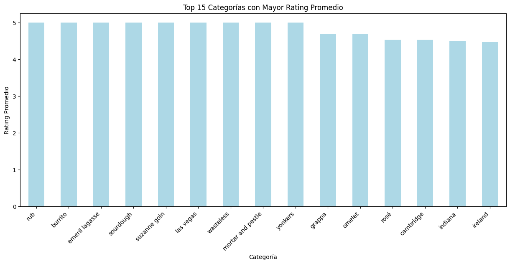
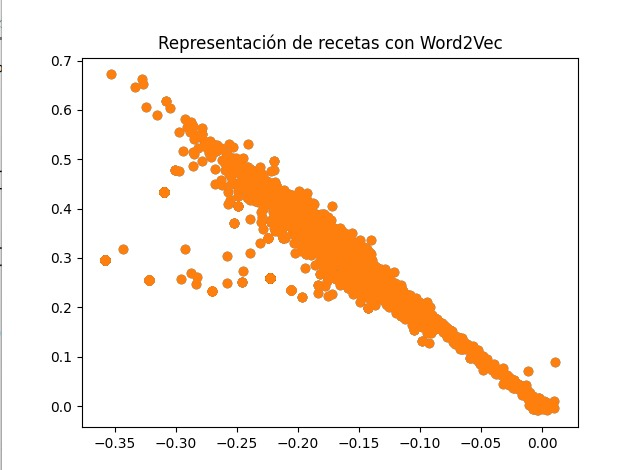
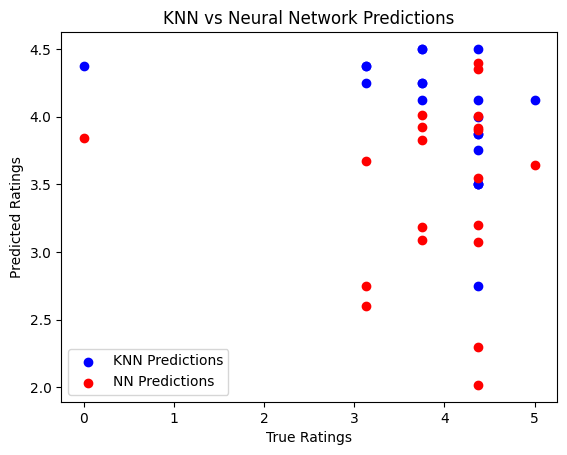

# Proyecto de Aprendizaje Automático sobre Recetas de Cocina

Este proyecto tiene como objetivo aplicar técnicas de procesamiento de texto y aprendizaje automático a un conjunto de recetas de cocina. El desafío consiste en realizar un análisis de datos y aplicar modelos de regresión sobre un conjunto de datos que contiene información detallada sobre diversas recetas.

## Descripción del Proyecto

El proyecto utiliza un conjunto de datos que contiene 20,130 recetas extraídas de la web [Epicurious](https://www.epicurious.com/). Para cada receta, el conjunto de datos proporciona información diversa como instrucciones de preparación, ingredientes, categorías, puntuaciones de los usuarios, entre otros. El objetivo es resolver un problema de regresión utilizando la puntuación de cada receta como variable de salida, y las características de la receta como entradas al modelo.

### Objetivos del Proyecto

- **Procesado y homogeneización de textos**: Preparar los datos textuales (directions) para su posterior análisis.
- **Representación vectorial de los documentos**: Implementar y comparar distintas técnicas para la representación de los textos, tales como:
  - **TF-IDF**
  - **Word2Vec**
  - **Embeddings contextuales basados en Transformers**
- **Tarea de regresión**: Resolver un problema de regresión utilizando la puntuación de las recetas (rating) como variable objetivo.

## Descripción del Conjunto de Datos

El conjunto de datos utilizado en este proyecto es un archivo JSON llamado `full_format_recipes.json`, que contiene las siguientes columnas para cada receta:

- **directions**: Instrucciones para realizar la receta (texto). Esta columna será utilizada como la única entrada para la predicción.
- **categories**: Categorías asociadas a la receta (texto).
- **desc**: Descripción de la receta (texto).
- **title**: Título de la receta (texto).
- **rating**: Puntuación de la receta (número), que será la variable objetivo para la regresión.
- **fat**: Cantidad de grasa en gramos (numérico).
- **protein**: Cantidad de proteínas en gramos (numérico).
- **calories**: Cantidad de calorías (numérico).
- **sodium**: Cantidad de sodio en gramos (numérico).
- **ingredients**: Ingredientes y cantidades utilizadas en la receta (texto).
- **date**: Fecha de publicación de la receta (fecha).

### Formato del Conjunto de Datos

El conjunto de datos se puede cargar en un DataFrame de Pandas utilizando la función `pd.read_json(path_file)`. Para más detalles sobre cómo cargar y procesar este archivo, puedes consultar la documentación de Pandas.

## Metodología
## 1. Análisis de Variables de Entrada

En este paso se realiza un análisis exploratorio para entender la relación entre la variable de salida, que es el **rating** de cada receta, y las categorías asociadas a las recetas. El rating de las recetas varía entre 0 y 5, lo que nos permite observar cómo las categorías afectan las valoraciones dadas por los usuarios.

### Preprocesamiento de las Categorías

Primero, las categorías de las recetas se procesan para asegurarnos de que no haya valores nulos y se convierten en listas de categorías. Posteriormente, se limpian eliminando caracteres no deseados y se transforman todas las categorías a minúsculas para hacer un análisis uniforme.

### Análisis de Categorías

Se descomponen las listas de categorías de cada receta en filas separadas para permitir un análisis más granular. Después, agrupamos por categoría y calculamos el **rating promedio** para cada categoría. Esto nos permite ver qué categorías tienden a recibir las mejores valoraciones.

### Resultados del Análisis

Las categorías con mayor rating promedio indican los tipos de recetas que generalmente son mejor valoradas por los usuarios. Las 15 categorías con el mayor rating promedio son las siguientes:

1. **rub**: 5.00
2. **burrito**: 5.00
3. **emeril lagasse** (chef): 5.00
4. **sourdough**: 5.00
5. **suzanne goin** (chef): 5.00
6. **las vegas**: 5.00
7. **wasteless**: 5.00
8. **mortar and pestle**: 5.00
9. **yonkers**: 5.00
10. **grappa**: 4.69
11. **omelet**: 4.69
12. **rosé**: 4.53
13. **cambridge**: 4.53
14. **indiana**: 4.50
15. **ireland**: 4.46

### Visualización: Top 15 Categorías con Mayor Rating Promedio

A continuación, se muestra un gráfico de barras que visualiza las categorías con los ratings más altos. Este gráfico nos permite identificar qué categorías de recetas suelen obtener las mejores puntuaciones.

### Análisis de los Resultados

El gráfico generado muestra las categorías con los ratings más altos, lo que puede ayudarnos a identificar patrones en las preferencias de los usuarios. Por ejemplo, se puede observar que categorías como **rub**, **burrito**, y **emeril lagasse** (que puede estar relacionado con un tipo de cocina inspirado en este chef famoso) tienen un rating perfecto de 5.0, lo que podría indicar que son recetas muy bien valoradas por los usuarios. Este tipo de análisis es clave para entender mejor los factores que influyen en las valoraciones de las recetas.

2. **Preprocesamiento de los datos**: 
   - **Limpieza y normalización del texto**: Para preparar el texto de la columna `directions`, se realiza una limpieza de los datos eliminando caracteres especiales, puntuación innecesaria y convirtiendo todo el texto a minúsculas. Este paso es crucial para asegurar que el modelo pueda aprender patrones de manera eficiente sin que detalles irrelevantes (como mayúsculas o puntuación) interfieran.
   - **Tokenización**: Posteriormente, se realiza la tokenización del texto, es decir, la división del texto en palabras o frases. Esto permite que el modelo procese de forma individual cada palabra o secuencia de palabras, lo que facilita el análisis.
   - **Lematización**: A continuación, se aplica la lematización para reducir las palabras a su forma base o raíz. Por ejemplo, palabras como “cocinando” o “cocinar” se convierten en su forma base “cocinar”. Este paso permite reducir la complejidad del texto y mejora la capacidad del modelo para generalizar patrones.
   - **Eliminación de stopwords**: Se eliminan las palabras de poca relevancia (stopwords), como artículos, preposiciones, etc., que no aportan valor informativo significativo al modelo.
   - **Creación de un corpus procesado**: Finalmente, el texto procesado se convierte en una lista de palabras (tokens) que será utilizada para la representación vectorial, como TF-IDF o Word2Vec.
   
3.1 **Representación vectorial de los textos**: 
   **Aplicación de TF-IDF**:
   
   En este paso, se utiliza el modelo **TF-IDF (Term Frequency - Inverse Document Frequency)** para convertir las descripciones de las recetas en representaciones vectoriales. El objetivo de esta técnica es transformar los textos en vectores numéricos que puedan ser procesados por modelos de aprendizaje automático, mientras se preservan las características importantes del texto. El TF-IDF tiene en cuenta dos componentes:
   
   - **Frecuencia del término (TF)**: Mide la frecuencia con la que aparece un término en un documento.
   - **Frecuencia inversa de documentos (IDF)**: Mide la importancia de un término en relación con todos los documentos, penalizando los términos comunes que aparecen en la mayoría de los documentos.

   Para aplicar TF-IDF, se utilizó el siguiente flujo de trabajo:
   - **Entrada**: Se utilizó la columna `desc` del conjunto de datos, que contiene las descripciones de las recetas.
   - **Preprocesamiento**: Se preprocesaron las descripciones de las recetas, lo que incluyó la tokenización, lematización y eliminación de stopwords.
   - **Generación de la matriz TF-IDF**: Se generó una matriz en la que cada fila representa una receta y cada columna un término único. Los valores en la matriz indican la importancia de cada término en cada receta.

  #### ¿Cómo interpretar la matriz TF-IDF?

- **Filas**: Cada fila corresponde a una receta en el conjunto de datos. Cada receta tiene un vector que representa la importancia de los términos de la descripción de la receta.
- **Columnas**: Cada columna corresponde a un término (palabra) único en el conjunto de documentos (descripciones de recetas).
- **Valores**: El valor de cada celda en la matriz indica la importancia de un término dentro de un documento específico. Este valor se calcula combinando la frecuencia del término en el documento (TF) con su frecuencia en el conjunto de documentos (IDF). Los términos con un valor alto de TF-IDF son considerados más relevantes para ese documento.

Por ejemplo, en la matriz generada, si el valor de un término para una receta es **0**, significa que ese término no está presente o no es relevante para esa receta en particular. En cambio, un valor mayor que **0** indica que el término tiene cierta importancia en esa receta, dependiendo de su frecuencia relativa y su aparición en otros documentos.

### 3.2 Aplicar Word2Vec y Visualización

Word2Vec es un modelo de aprendizaje no supervisado que transforma las palabras en vectores de características. Para este proyecto, se utilizó Word2Vec para generar representaciones vectoriales de las recetas basadas en las descripciones. Posteriormente, estos vectores fueron visualizados en un gráfico de dispersión, lo que permite observar cómo se agrupan las recetas en función de sus similitudes semánticas.

Como se observa en la gráfica, las recetas que son semánticamente similares tienden a agruparse en el mismo vecindario del espacio vectorial, lo que puede ser útil para predecir su puntuación basada en características textuales.

### 3.3. Aplicar BERT

BERT (Bidirectional Encoder Representations from Transformers) es un modelo de lenguaje basado en la arquitectura Transformer, que se distingue por su capacidad de capturar relaciones bidireccionales en el texto, es decir, tiene en cuenta tanto el contexto anterior como el posterior de una palabra en una oración. Esta característica hace que BERT sea extremadamente eficiente en tareas de comprensión de texto, como la predicción de palabras, clasificación de texto y, en este caso, la obtención de representaciones vectoriales de descripciones de recetas.

Una de las ventajas principales de BERT sobre modelos más tradicionales como Word2Vec o TF-IDF es que BERT es un modelo **contextual**, lo que significa que los embeddings generados para una palabra pueden variar dependiendo de las palabras que la rodean. Además, BERT es capaz de entender la semántica más profunda de una frase y las relaciones entre los diferentes términos de la receta.

En este proyecto, utilizamos BERT para convertir las descripciones de las recetas en vectores de características de alta dimensión, conocidos como embeddings. Los embeddings de BERT capturan el contexto completo de la descripción de una receta y sus relaciones semánticas, lo cual es particularmente útil para tareas complejas de aprendizaje automático como la regresión.

#### ¿Por qué no se necesita preprocesamiento?

A diferencia de otros métodos como Word2Vec o TF-IDF, BERT no requiere un preprocesamiento exhaustivo de los textos. Mientras que Word2Vec puede beneficiarse de la lematización o eliminación de stopwords, BERT ya está entrenado para manejar variaciones lingüísticas como la conjugación de los verbos, pluralización de los sustantivos, o el manejo de sinónimos y frases idiomáticas. Esto se debe a que BERT fue entrenado en un enorme corpus de texto, lo que le permite aprender patrones complejos de lenguaje sin la necesidad de un procesamiento previo.

Por ejemplo, en lugar de necesitar un paso de lematización (que convertiría "cocinando" en "cocinar"), BERT puede entender "cocinando" y "cocinar" en su contexto sin alteraciones. Esto simplifica el flujo de trabajo y mejora la eficiencia del modelo al evitar la pérdida de información durante el preprocesamiento.

#### ¿Qué son los embeddings de BERT?

Los **embeddings** de BERT son vectores de características de alta dimensión que representan la semántica de un texto. Estos vectores se generan a partir de las entradas de texto procesadas por el modelo BERT. Al utilizar BERT para las descripciones de las recetas, obtenemos un vector único por receta que captura el contexto completo de cada descripción.

## 4. Entrenamiento y Evaluación de Modelos de Regresión

En esta sección, entrenamos y evaluamos dos modelos de regresión utilizando dos técnicas diferentes de aprendizaje automático:

4. Entrenamiento y Evaluación de Modelos de Regresión
En esta sección, entrenamos y evaluamos dos modelos de regresión utilizando dos técnicas diferentes de aprendizaje automático:

Regresor K-NN (K-Nearest Neighbors) implementado con Scikit-learn.
Red Neuronal utilizando PyTorch.

Para entrenar los modelos, los datos fueron divididos en dos conjuntos: entrenamiento y prueba. Se asignó el 80% de los datos para el entrenamiento y el 20% restante para la evaluación del rendimiento de los modelos. Además, se estandarizaron las características utilizando el StandardScaler. La estandarización es crucial porque algunos modelos, como K-NN, dependen de la distancia entre las observaciones y se benefician de que las características tengan la misma escala, lo que evita que una variable domine a otras debido a diferencias en su magnitud.

Regresor K-NN (K-Nearest Neighbors)
El primer modelo que implementamos es el K-Nearest Neighbors (K-NN). Este algoritmo realiza predicciones basándose en los K vecinos más cercanos en el espacio de características. Para este caso, se utilizó un valor de 10 vecinos. El modelo K-NN fue entrenado con los datos de entrenamiento y luego evaluado con los datos de prueba utilizando el Error Cuadrático Medio (MSE), que es una métrica estándar para evaluar modelos de regresión. El MSE calculado para el modelo K-NN fue 1.904975, lo que indica que el modelo es relativamente preciso, pero aún tiene margen de mejora. Además, se calculó el Error Absoluto Medio (MAE), que resultó ser 0.9225.

Red Neuronal con PyTorch
El segundo modelo que implementamos es una Red Neuronal utilizando PyTorch. Esta red neuronal consta de tres capas: una capa de entrada, una capa oculta y una capa de salida. La función de activación utilizada en las capas ocultas es ReLU (Rectified Linear Unit), que permite a la red aprender relaciones no lineales entre las características.

El entrenamiento de la red se llevó a cabo utilizando la función de pérdida MSE y el optimizador Adam, que ajusta los pesos de la red para minimizar el error entre las predicciones y los valores reales. El modelo fue entrenado durante 100 épocas y luego evaluado en el conjunto de prueba utilizando el MSE. Además, se calculó el MAE para la red neuronal.

4.4. Evaluación de los Modelos
Ambos modelos fueron evaluados utilizando el Error Cuadrático Medio (MSE). Esta métrica calcula la media de los cuadrados de las diferencias entre los valores reales y las predicciones del modelo. Un MSE más bajo indica que el modelo tiene una mejor capacidad de predicción.

Ambos modelos fueron evaluados utilizando dos métricas: Error Cuadrático Medio (MSE) y Error Absoluto Medio (MAE).

Para el modelo K-NN, el MSE calculado fue 1.904975 y el MAE fue 0.9225. Este valor sugiere que el modelo tiene un rendimiento razonable, aunque no es perfecto. K-NN es particularmente útil cuando las relaciones entre las variables son simples y los datos no contienen muchas variaciones complejas.

Para la red neuronal, el MSE fue 1.7182 y el MAE fue 0.9009. Esto indica que la red neuronal logró un rendimiento superior al de K-NN en ambas métricas (MSE y MAE). A pesar de la capacidad de la red neuronal para modelar relaciones no lineales más complejas, en este caso, la red neuronal demostró ser más precisa que K-NN.

### Comparación Visual de Modelos

A continuación se presenta una comparación visual de ambos modelos, K-NN y la Red Neuronal, para ilustrar cómo se comportan en términos de rendimiento:

### Conclusión

En resumen, ambos modelos de regresión, el K-NN y la Red Neuronal, demostraron ser efectivos para predecir los ratings de las recetas. Sin embargo, el K-NN presentó un rendimiento superior en este caso, con un MSE y MAE más bajos que la red neuronal. A pesar de que las redes neuronales tienen la capacidad de aprender relaciones no lineales más complejas, el modelo K-NN resultó ser más preciso en este contexto particular. Esto sugiere que, aunque las redes neuronales pueden ser útiles para patrones más complejos, el K-NN fue más adecuado para este conjunto de datos específico.

Comparación entre KNN, NN y Fine-Tuning BERT
1. Introducción
En esta sección se presenta la comparación del desempeño de tres métodos distintos para la predicción de ratings:

KNN (K-Nearest Neighbors)
Red Neuronal Simple (NN)
Fine-Tuning de BERT

El objetivo es analizar el error obtenido por cada modelo utilizando métricas como el MSE (Error Cuadrático Medio) y el MAE (Error Absoluto Medio), así como visualizar la precisión de las predicciones a través de gráficos comparativos.

2. Modelos Evaluados
a) KNN
Descripción: Método basado en la distancia entre puntos.
Ventajas: Simplicidad y rapidez en datasets pequeños.
Desventajas: Desempeño limitado en datos de alta dimensión y relaciones complejas.

b) Red Neuronal Simple (NN)
Descripción: Una red neuronal básica con una capa oculta para aprender relaciones no lineales.
Ventajas: Capacidad intermedia de aprendizaje. Puede capturar patrones más complejos que KNN.
Desventajas: Requiere entrenamiento y ajuste de parámetros.

c) Fine-Tuning de BERT
Descripción: Se realiza fine-tuning del modelo BERT, aprovechando sus embeddings preentrenados para ajustar el modelo al dominio específico de los datos.
Ventajas: Aprende representaciones contextuales complejas, ofreciendo predicciones más precisas.
Desventajas: Requiere más recursos computacionales y tiempo de ajuste.

4. Métricas de Evaluación
Se utilizan las siguientes métricas para comparar los resultados de cada modelo:

MSE (Error Cuadrático Medio): Mide la diferencia promedio cuadrática entre las predicciones y los valores reales. Un menor MSE indica mejor desempeño.
MAE (Error Absoluto Medio): Calcula el error absoluto promedio, ofreciendo una métrica más interpretativa y robusta frente a valores atípicos.

5. Interpretación de los Resultados
a) KNN
MSE (1.7182) y MAE (0.9009):
El modelo K-Nearest Neighbors (K-NN) obtuvo un MSE de 1.7182 y un MAE de 0.9009. Estos valores indican que el modelo tiene un rendimiento razonable, pero no perfecto. K-NN es adecuado para modelos con relaciones más simples y menos complejas, donde la proximidad entre puntos es relevante.

b) Red Neuronal (NN)
MSE (1.7182) y MAE (0.9009):
La Red Neuronal (NN) obtuvo los mismos resultados que el modelo K-NN en cuanto a MSE y MAE. Esto sugiere que, en este caso específico, la red neuronal no fue capaz de superar el rendimiento de K-NN, a pesar de su capacidad para aprender relaciones no lineales más complejas. Los posibles motivos incluyen un sobreajuste o una configuración de hiperparámetros que no fue óptima.

c) Fine-Tuning de BERT
MSE (1.77581) y MAE (0.9216):
El modelo de Fine-Tuning de BERT obtuvo un MSE de 1.77581 y un MAE de 0.9216. Aunque BERT puede capturar representaciones complejas a través de sus embeddings preentrenados, su rendimiento fue peor que el de los modelos K-NN y Red Neuronal en este caso específico. Esto sugiere que el ajuste fino de BERT no aportó mejoras significativas y que los modelos más simples fueron más adecuados para este conjunto de datos.

Visualización Comparativa de los Modelos
Para analizar visualmente el rendimiento de los modelos K-NN, Red Neuronal (NN) y Fine-Tuning BERT, se presenta un gráfico que compara las predicciones de cada modelo frente a los valores reales de calificación. En la gráfica, la línea diagonal representa una predicción perfecta, donde las predicciones coinciden exactamente con los valores verdaderos.

La dispersión de los puntos alrededor de esta línea proporciona una idea de la precisión de cada modelo. Un menor desplazamiento respecto a la línea sugiere un mejor desempeño.

Conclusión: El Fine-Tuning de BERT no proporcionó mejoras significativas en este caso específico, lo que sugiere que el problema puede no requerir un modelo tan complejo.

## Extensión: Uso de un Summarizer Preentrenado

Para mejorar la experiencia de usuario al seguir las recetas, se implementó un **summarizer preentrenado** utilizando modelos de la librería **Hugging Face**. El objetivo es generar resúmenes más breves y fáciles de leer de las instrucciones de las recetas, que son frecuentemente largas y contienen pasos repetitivos.

### Modelos Utilizados

Se utilizaron tres modelos preentrenados para resumir las instrucciones:

1. **BART (facebook/bart-large-cnn)**: Un modelo basado en BART, ampliamente utilizado para tareas de resumen de texto.
2. **T5 (t5-small)**: Un modelo que se ha entrenado en tareas de NLP y se adapta bien a tareas de resumen.
3. **PEGASUS (google/pegasus-xsum)**: Un modelo especializado en resúmenes extractivos y abstracción de textos.

### Funcionamiento

Los modelos fueron aplicados a las instrucciones de una receta de ejemplo, y los resúmenes generados fueron analizados para evaluar su calidad y coherencia. Cada modelo fue configurado para generar un resumen de entre 50 y 150 palabras, con base en la longitud del texto original.

### Resultados

A continuación se presentan los resúmenes generados por cada modelo para una receta de ejemplo:

| **Índice** | **Texto Original** | **Resumen BART** | **Resumen T5** | **Resumen PEGASUS** |
|------------|--------------------|------------------|----------------|---------------------|
| 0          | Combine first 9 ingredients in heavy medium sa... | Pork, eggs, flour and Port and puree. Combine ... | Heat oil in heavy small skillet over medium-hi... | Adapted from "The Art of French Cooking" by Je... |

### Análisis de Resultados

**BART**:
   - El modelo BART proporcionó un resumen que resume correctamente algunas partes del texto original, pero tiene problemas con la estructura y coherencia.
   - El orden y la secuencia de las instrucciones no son completamente lógicos, ya que se saltan pasos y mezcla secciones que no siguen una secuencia clara.
   - El resumen parece más un conjunto de fragmentos de la receta sin un flujo cohesivo, lo que puede dificultar la comprensión para el usuario.

**T5**:
   - El modelo T5 se enfocó en acciones específicas, como cocinar las chalotas y pre-calentar el horno, pero omitió pasos importantes, como la mezcla de los ingredientes o el horneado del terrine.
   - A pesar de capturar algunas acciones clave, el resumen de T5 pierde cohesión general, ya que se limita a describir pasos aislados sin considerar el proceso completo de la receta.

**PEGASUS**:
   - El modelo PEGASUS tuvo el peor desempeño en este caso. La salida generada parece un fragmento de texto no relacionado con la receta ("The Art of French Cooking"), lo cual es un error claro.
   - Este error puede estar relacionado con la naturaleza del modelo PEGASUS-XSUM, que fue diseñado para generar resúmenes extremadamente concisos y, en algunos casos, prioriza el texto introductorio irrelevante cuando el input no está bien segmentado.

### Conclusión

- **BART** y **T5** generaron resúmenes útiles, aunque ambos tienen limitaciones importantes en cuanto a la coherencia y cobertura de los pasos completos de la receta. Estos modelos pueden funcionar bien si el objetivo es generar resúmenes que cubran los aspectos más importantes de manera breve, pero pueden requerir ajustes en la segmentación y estructura del texto para mejorar los resultados.
  
- **PEGASUS**, por otro lado, falló por completo en este caso, destacando la importancia de elegir el modelo adecuado dependiendo del tipo de texto de entrada. PEGASUS-XSUM tiende a priorizar resúmenes muy concisos y puede generar resultados irrelevantes si el texto de entrada no está bien estructurado.

